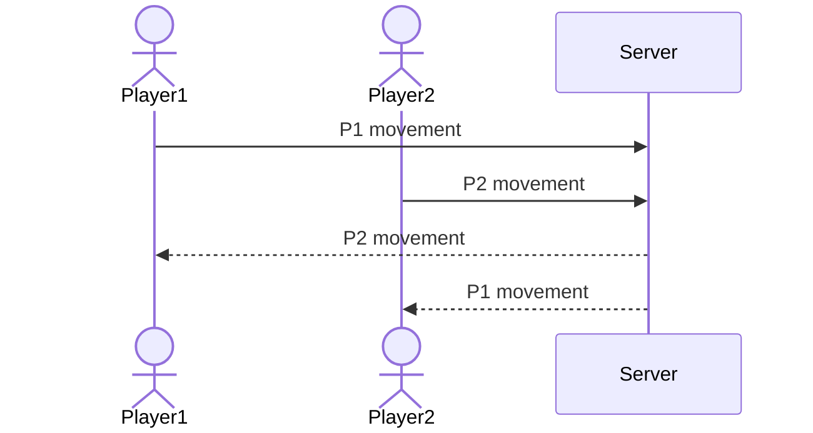

# Maze Race

[My Notes](notes.md)

This game creates a procedurly generated maze for two players to explore. The players race to get to the goal, while having their locations updated in real time through Websocket. 

> [!NOTE]
>  This is a template for your startup application. You must modify this `README.md` file for each phase of your development. You only need to fill in the section for each deliverable when that deliverable is submitted in Canvas. Without completing the section for a deliverable, the TA will not know what to look for when grading your submission. Feel free to add additional information to each deliverable description, but make sure you at least have the list of rubric items and a description of what you did for each item.

> [!NOTE]
>  If you are not familiar with Markdown then you should review the [documentation](https://docs.github.com/en/get-started/writing-on-github/getting-started-with-writing-and-formatting-on-github/basic-writing-and-formatting-syntax) before continuing.

## 🚀 Specification Deliverable

> [!NOTE]
>  Fill in this sections as the submission artifact for this deliverable. You can refer to this [example](https://github.com/webprogramming260/startup-example/blob/main/README.md) for inspiration.

For this deliverable I did the following. I checked the box `[x]` and added a description for things I completed.

- [x] Proper use of Markdown
- [x] A concise and compelling elevator pitch
- [x] Description of key features
- [x] Description of how you will use each technology
- [x] One or more rough sketches of your application. Images must be embedded in this file using Markdown image references.

### Elevator pitch

I want to make a game where two players race to solve a randomly generated maze in real time. Every new game creates a new procedurally generated maze. Two players can then connect to the game and have their position displayed in real time. The first player to reach the end wins.

### Design

.
.
.

The first screen contains two options, Login and Sign Up, allowing new players to create an account and exitsing players to login in. The second screen has two options, to either create a new game or joing a pre-existing one. The third screen is the game itself, containing a procedurallly generated maze and allowing the player to control their character by way of arrow keys.

### Key features

- Maze generation, procedurally generates maze to explore
- Player Movement
- Start and End Points
- Win Condition
- Muliplayer: Websocket allows for multiplayer in real time.

### Technologies

I am going to use the required technologies in the following ways.

- **HTML** - Three HTML pages, one for login/sign up, one for create/joing game, and the game itself
- **CSS** - Use CSS to style application, different colors for players, create high contrast maze that is easy to see and navigate.
- **React** - USe React to create components reactive to user actions (elements of the maze)
- **Service** - Backend for storing and retrieving games, allowing players to join other games with room code
- **DB/Login** - Store user info in database, retrieves the outcomes of previous matches and displays them
- **WebSocket** - As player moves, their position is displayed in real time to other player
- **Apis** - Use external api to generate random mazes https://github.com/odinn1984/mgapi, use 100ms api to generate and manage room codes

## 🚀 AWS deliverable

For this deliverable I did the following. I checked the box `[x]` and added a description for things I completed.

- [x] **Server deployed and accessible with custom domain name** - [My server link](https://mjweb260.click).

## 🚀 HTML deliverable

For this deliverable I did the following. I checked the box `[x]` and added a description for things I completed.

- [x] **HTML pages** - Created html pages for login, create/join game, gameplay, and game over screen
- [x] **Proper HTML element usage** - Used proper HTML elements to create framework of webpage
- [x] **Links** - Put links conecting html pages together
- [x] **Text** - added text denoting what page the user is on
- [x] **3rd party API placeholder** - put placeholder for the API used to create and manage roomcodes and the API to create random mazes
- [x] **Images** - I added images representing the maze and for the "prize" on the win screen
- [x] **Login placeholder** - Put input boxes for where the user will enter email and password
- [x] **DB data placeholder** - Put placeholder for where database will display the outcomes of 3 most recent matches
- [x] **WebSocket placeholder** - Put place holder for where websocket will notify player1 of 2nd player entering room

## 🚀 CSS deliverable

For this deliverable I did the following. I checked the box `[x]` and added a description for things I completed.

- [x] **Header, footer, and main content body** - Added header and body color. Added links to footer.
- [x] **Navigation elements** - Added buttons to move between pages. Made button function obvious with label.
- [x] **Responsive to window resizing** - Added CSS to make page responsive to window resizing.
- [x] **Application elements** - Configured sign in boxes to be larger and easier to see.
- [x] **Application text content** - Changed text font to be more interesting. Centered text.
- [x] **Application images** - Added and configured images that will be a part of application

## 🚀 React part 1: Routing deliverable

For this deliverable I did the following. I checked the box `[x]` and added a description for things I completed.

- [x] **Bundled using Vite** - I did this
- [x] **Components** - Created components for login, create game, join game, play and gameover
- [x] **Router** - Routing between login, create game, join game, play, and gameover components

## 🚀 React part 2: Reactivity

For this deliverable I did the following. I checked the box `[x]` and added a description for things I completed.

- [x] **All functionality implemented or mocked out** - Screen changes based on logged in / logged out state, implemneted maze functionality (arrow keys move player character, reaching goal transitions player to gameover screen).
- [x] **Hooks** - useState stores player position in maze, useEffect reacts to arrow key presses and reacts to player finishing the maze

## 🚀 Service deliverable

For this deliverable I did the following. I checked the box `[x]` and added a description for things I completed.

- [x] **Node.js/Express HTTP service** - wrote endpoints using express
- [x] **Static middleware for frontend** - Middleware to verify auth token and verify joingame call request is correct
- [x] **Calls to third party endpoints** - use thirdparty endpoint to randomly generate trophy image for win screen
- [x] **Backend service endpoints** - Implemented endpoints for register, login, logout
- [x] **Frontend calls service endpoints** - register/login/logout functionality all correctly calls endpoints

## 🚀 DB/Login deliverable

For this deliverable I did the following. I checked the box `[x]` and added a description for things I completed.

- [x] **User registration** - register stores user in mongodb
- [x] **User login and logout** - login and logout adds/removes authtoken from database
- [x] **Stores data in MongoDB** - stores user win count in database
- [x] **Stores credentials in MongoDB** - stores username and password in db
- [x] **Restricts functionality based on authentication** - auth middleware stops unauthenticated endpoints from being hit

## 🚀 WebSocket deliverable

For this deliverable I did the following. I checked the box `[x]` and added a description for things I completed.

- [ ] **Backend listens for WebSocket connection** - I did not complete this part of the deliverable.
- [ ] **Frontend makes WebSocket connection** - I did not complete this part of the deliverable.
- [ ] **Data sent over WebSocket connection** - I did not complete this part of the deliverable.
- [ ] **WebSocket data displayed** - I did not complete this part of the deliverable.
- [ ] **Application is fully functional** - I did not complete this part of the deliverable.
